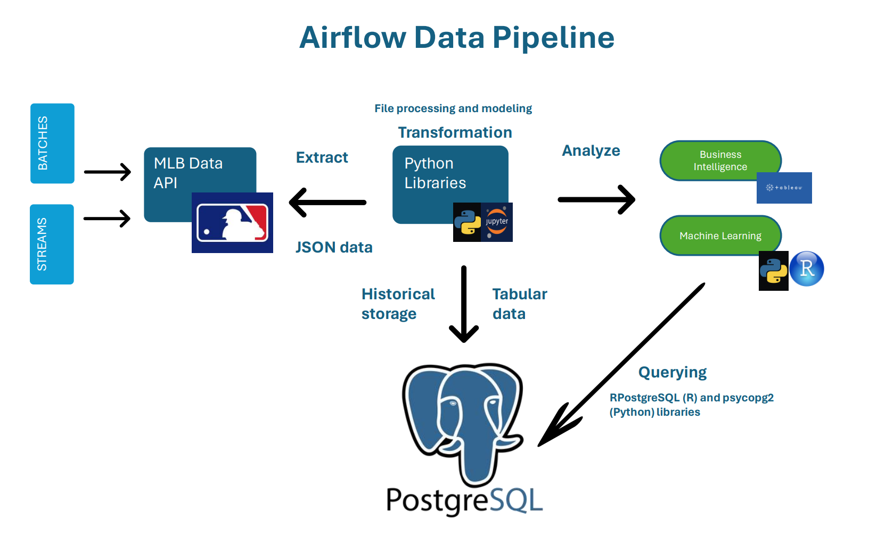

# Automating a 5-stage MLB Data Pipeline using Apache Airflow (via WSL 2.0)
  

## Overview
As a baseball enthusiast, I often wonder how sports networks such as ESPN, Bally, and Spectrum Sportsnet can provide viewers with intriguing statistics on their players instantaneously. 
It makes perfect sense once you realize that baseball spearheaded sports analytics, which is now considered by many as the antithesis to the traditional "eye test" that has managed sports 
since its creation. As portrayed in the legendary movie *Moneyball* (10/10, must watch before looking through this project), managers use statistical models based on player performances to make 
decisions such as lineup changes, trades, drafting, etc., all of which are core functions in running an organization.

In this project, I attempt to answer the new-age question, "How are these stats getting fed to me in real-time?" by [creating and automating](dag_creation.ipynb) a 5-stage data pipeline that provides users with a continuous feed of player analysis throughout the season. 

## Apache Airflow

[Apache Airflow](https://airflow.apache.org/docs/apache-airflow/stable/index.html) is an open-source Workflow Management System that allows you to define tasks and their dependencies as code. It then executes these tasks on a regular schedule and distributes the task 
execution across worker processes. 

In Airflow, workflows are made up of tasks that have directional dependencies. These dependencies are represented using directed acyclic graphs (DAGs). Each node in the graph is a 
task, and edges define the dependencies among the tasks. At a high level, a DAG can be thought of as a container that holds tasks and their dependencies, and sets the context for 
when and how those tasks should be executed.

## Diagram

  

## Packages Used

*Python 3.11*
- airflow
- requests
- json
- pickle
- numpy 
- pandas
- sci-kit learn
- psycopg2

*PostgreSQL*
- SQL

## How to Use

1. Clone the repository.
2. As of the creation of this project, there is no Windows compatibility for Airflow. Please refer to [this document](https://github.com/mgcruz024/airflow-mlb/blob/037a0c74b98583c6b80b7f50c14d8eb71132f81f/Running%20Airflow%20on%20WSL.txt) for setting up Apache Airflow via Windows Subset for Linux (WSL) prior to running the scripts.
3. Create a "dags" folder inside of your airflow folder then copy the dag python script into this new dags folder.
     - mkdir airflow/dags
     - cp /{file_path}/mlb_dag.py airflow/dags
5. Initialize Airflow and run the dag.

## Notes

This project is ongoing, and I am constantly thinking of new ways to modernize my workflow. Tools and concepts that I plan on
integrating in the future includes: 
- cloud storage (Redshift, Azure Data Lake, Amazon RDS, etc.)
- cloud analytics (Synapse Analytics, QuickSight,etc.) 
- NoSQL databases to optimize the JSON files extracted from the API

Feedback would be greatly appreciated!

